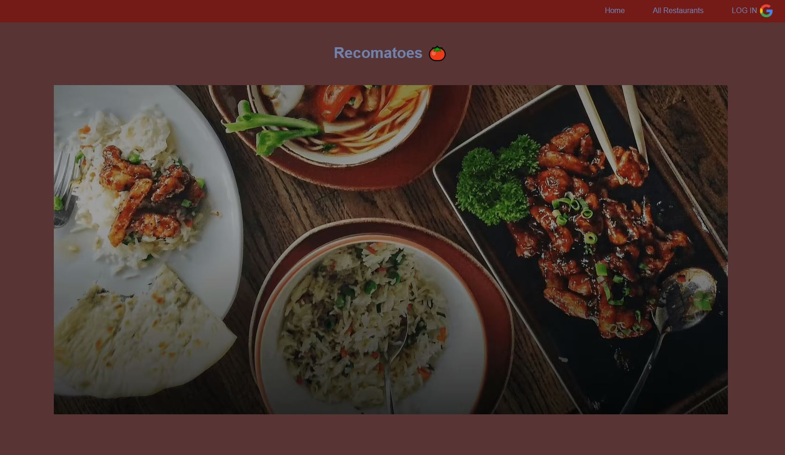
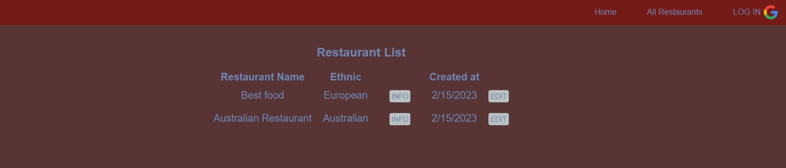
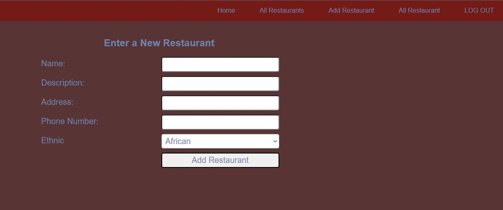

   

# Roy John Lee
**Created by [Roy John Lee](https://www.linkedin.com/in/roy-john-lee/)**
### [CLICK TO PLAY](https://royjohnlee.github.io/Minesweeper/)

  
   
  [Linkedin](https://www.linkedin.com/in/roy-john-lee-018443173/)
   

## App Title: Recomatoes 🍅

An App to add restaurants for people to see and review. Primary designed for those that are in need of a place to eat and see if what others think of the place (reviews). Great place for those that want to share their favorite place to eat and for those that are in need of a new place!

##  Screenshots 📷
 *Landing Page*
------------

*All Restaurant*
------------

 *ADD Restaurant*
------------

 | Languages  | Frameworks & Libraries  | Databases| Tools |
| -------- | --------- | -- | -- |
|     |     |  |    

##  Getting Started 🍽️
----------------------
| Heroku  |
| -------- |
https://restaurant-rec.herokuapp.com/

| Trello  |
| -------- |
https://trello.com/b/t3CXIEwi/project-2

## Next Step
------------
- I want to add a User profile page along with their avatar when they're signed in
- I'm going to add pictures for user/viewers to see.
- I'm going to make a lote more visual changes for better UI experience
